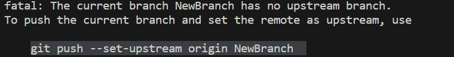
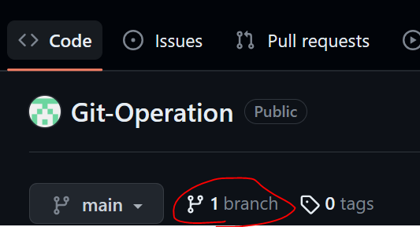

# Git Operation 
## Branchを作る 
### Git Branch 
[Git Branch の解説　個人サイト](https://codelikes.com/git-branch/)
[Git Branch のコマンド さる先生](https://backlog.com/ja/git-tutorial/stepup/07/)

1. Branch を作る
   `$ git branch NewBranch`
2. Git branch コマンドで確認できる
   `$ git branch`
3. 実行コマンド結果
   
4. ブランチに移動する
   `$ git checkout NewBranch` 
   
5. コミットしてプッシュする
   `git add <file>`
   `git commit -m "BranchTest"`
   `git push origin`
   
   というエラーが出るので、、、NG
   これは、新規Branchがまだ無いため…。仕方ない
   
6. 指示通り、オプションをつけて、プッシュする
   `git push --set-upstream origin NewBranch`

 
