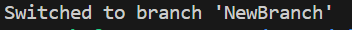

# Git Operation 
## Branchを作る 
### Git Branch 
[Git Branch のコマンド　Merge さる先生](https://backlog.com/ja/git-tutorial/stepup/09/)

1. マージするのはこれなんだが
   - `$ git merge <commit>` 
2. まずはメインブランチに移動する（main）
   - `$ git checkout main`
3. 実行コマンド結果
   - 
4. Git Mergeコマンドを実行！！
   - `git merge NewBranch`
5. Branch を削除する
   - `git branch -d NewBranch`